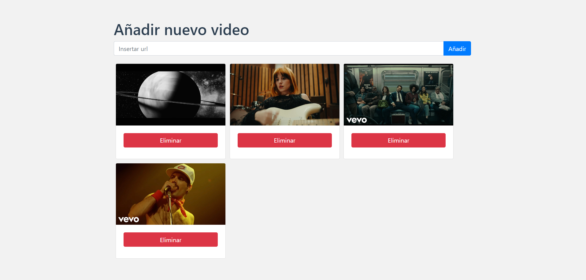
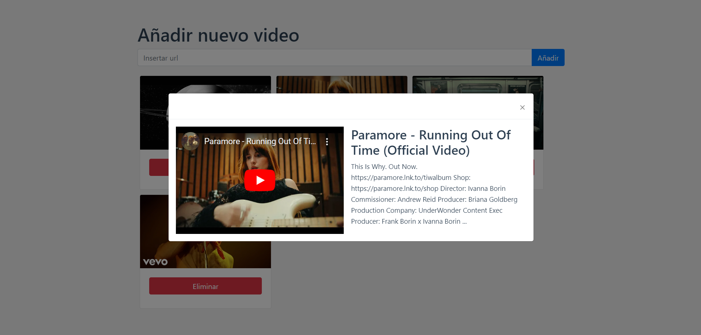
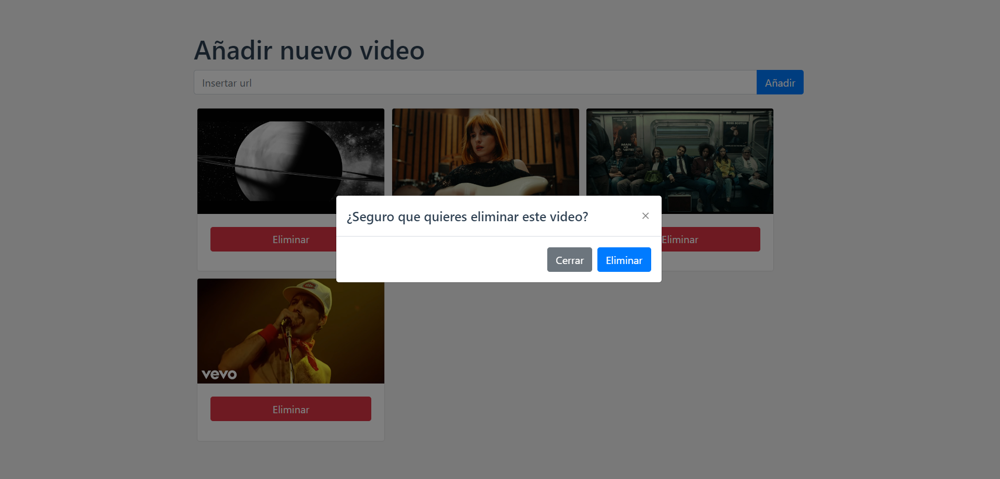
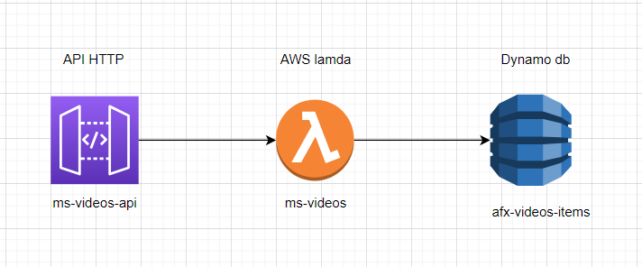

#  Video-album-afex

Este proyecto prueba consiste en un álbum online de videos de youtube, donde podrás pegar links de videos y visualizar todos los que hayas guardado, pudiendo ver las miniaturas e información sobre éstos, además de reproducirlos y eliminarlos. 

## Tecnologias 

<ul>
    <li>Vue3</li>
    <li>Typescript</li>
    <li>Boostrap</li>
    <li>Node.js</li>
    <li>AWS : Lambda, API http, Dynamo.db</li>
</ul>

## Preview





## Arquitectura cloud




## Project Setup

```sh
npm install
```

### Compile and Hot-Reload for Development

```sh
npm run dev
```

